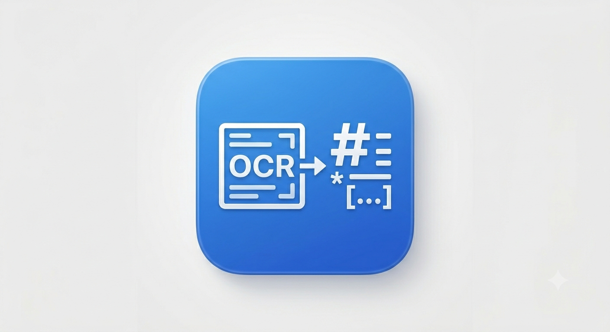

# OCRer

<p align="center">
  
</p>

截图 OCR 工具，支持硅基流动和 PaddleOCR。

## 功能

- 全局快捷键截图识别 (⌘⇧O)
- 支持硅基流动 / PaddleOCR 两种服务
- 识别结果自动复制到剪贴板
- Markdown 渲染（支持 LaTeX 数学公式）
- 可视化配置界面

## 快速开始

```bash
# 安装依赖
cd python-backend && pip3 install -r requirements.txt
cd ../electron-frontend && npm install

# 启动
./start.sh
```

## OCR 服务

**硅基流动** - 注册 [cloud.siliconflow.cn](https://cloud.siliconflow.cn/) 获取 API Key

| 模型 | 说明 |
|------|------|
| deepseek-ai/DeepSeek-OCR | DeepSeek OCR |
| zai-org/GLM-4.6V | 智谱视觉模型 |
| Qwen/Qwen2.5-VL-7B-Instruct | 通义千问 |

**PaddleOCR** - 访问 [aistudio.baidu.com/paddleocr/task](https://aistudio.baidu.com/paddleocr/task) 获取令牌

| 模型 | 说明 |
|------|------|
| PaddleOCR-VL-1.6 | 最新版（默认） |
| PaddleOCR-VL-1.5 | 稳定版 |
| PP-OCRv5 | 轻量版 |

## 使用

1. 点击「开始截图」或按 ⌘⇧O
2. 框选要识别的区域
3. 结果自动显示并复制到剪贴板
4. 点击「渲染」可切换 Markdown/源码视图

## 首次运行权限设置

首次运行时，需要授予**屏幕录制**权限：

1. 打开 **系统偏好设置** → **隐私与安全性** → **屏幕录制**
2. 点击 **+** 按钮，添加 OCRer 应用
3. 重启 OCRer 应用

如果没有授权，截图功能将无法正常工作。

## 许可证

MIT
